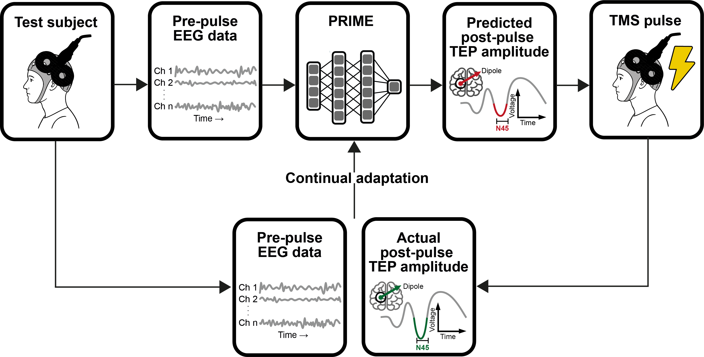

# PRIME: Personalized Real-time Inference of Momentary Excitability



This repository contains research code for the paper:   
***PRIME: Personalized Real-time Inference of Momentary Excitability from Human EEG***   
by [Haxel*](mailto:lisa.haxel@uni-tuebingen.de), [Ahola](mailto:oskari.ahola@aalto.fi), [Kapoor](mailto:jaivardhan.kapoor@uni-tuebingen.de), [Ziemann](https://ziemannlab.com), and [Macke†](https://mackelab.org) (2025).

## Overview

PRIME (Personalized Real-time Inference of Momentary Excitability) is a deep neural network that predicts cortical excitability, modeled as TMS-evoked potential (TEP) amplitudes, from raw EEG signals in real-time. The framework incorporates transfer learning and continual adaptation to automatically identify personalized brain-state biomarkers for individualized optimization of stimulation timing. Unlike MEP-based approaches that are limited to motor cortex, PRIME enables brain state-dependent stimulation across any cortical region by targeting cortical excitability without spinal confounds.

## Installation

To run the experiments, first install all requirements. We recommend creating a conda environment. A GPU is recommended for optimal performance.

```bash
git clone git@github.com:user/PRIME.git
cd PRIME
conda create --name prime python=3.11
conda activate prime
pip install -e . # install from requirements.txt
# optional: install jupyter notebook
pip install jupyter
```

## Data Setup

PRIME was evaluated using TMS-EEG data from the European Research Council-funded ConnectToBrain project. The data comprise recordings from 50 healthy adults with concurrent EEG and EMG recordings during single-pulse TMS targeting the left primary motor cortex.

**Note**: The dataset is not publicly available but can be requested from the corresponding authors for research purposes, subject to ethical approval and data agreements.

## Code Structure

The core functionality is implemented across several key modules:

- **`train_transfer.py`**: Main training functions for population-level pretraining and online adaptation
- **`tta_wrapper.py`**: Test-time adaptation wrapper implementing the continual learning framework
- **`models/`**: Neural network architectures including PRIME and benchmark models
- **`preprocessing/`**: EEG/TMS data preprocessing pipelines and TEP extraction
- **`interpretability.py`**: Neurophysiological feature analysis tools


## Running Experiments

### Key Experimental Configurations

```python
# Core PRIME training phases
phases = {
    "PRE-ZS": "Population pretraining only (zero-shot)",
    "PRE-CAL": "Pretraining + subject calibration", 
    "PRE-FT": "Complete PRIME framework with continual adaptation",
    "SS-CAL": "Subject-specific calibration only",
    "SS-FT": "Subject-specific training from scratch"
}
```

### Training Pipeline

1. **Population-level Pretraining**: Train on subset of subjects using 2-fold cross-validation
2. **Subject-specific Calibration**: Adapt pretrained model using first 100 trials from test subject
3. **Online Continual Adaptation**: Deploy with trial-by-trial updates using sliding window of recent trials


## Generating Figures and Analysis

### CSV Data Generation
The `figures/` directory contains scripts to generate analysis data:

- `create_csv_fig1cd.py`: Hierarchical learning performance comparison
- `create_csv_fig3b.py`: Architecture comparison analysis  
- `create_csv_fig4.py`: Hyperparameter sensitivity analysis
- `create_csv_figs1.py`: Comprehensive framework evaluation
- `create_csvs_fig5_figs2.py`: Neurophysiological interpretability analysis

Run these scripts to generate the necessary CSV files in the `figures/` directory.

### Figure Creation
Use the Jupyter notebooks to create figures from the generated CSV data:
- `fig1cd.ipynb`: Performance across training conditions
- `fig3b.ipynb`: Model architecture comparisons
- `fig4.ipynb`: Optimization and generalizability analysis
- `fig5_figs2.ipynb`: Feature interpretability and brain maps
- `figs1.ipynb`: Supplementary latency analysis

## Hardware Requirements

- **CPU**: Multi-core recommended (8+ cores optimal)
- **GPU**: Consumer GPU (RTX 2080Ti or equivalent) for real-time performance
- **Memory**: 8GB+ RAM for data processing


## Preprocessing Pipeline

The preprocessing workflow simulates real-time constraints:

1. **Calibration Phase**: Establish subject-specific parameters from initial trials
2. **Application Phase**: Apply fixed parameters to subsequent trials
3. **TEP Extraction**: Current dipole modeling for single-trial amplitudes
4. **Real-time Compatibility**: All steps optimized for online deployment

## Citation

```bibtex
@article{haxel_ahola2025prime,
    title={PRIME: Personalized Real-time Inference of Momentary Excitability from Human EEG},
    author={Lisa Haxel and Oskari Ahola and Jaivardhan Kapoor and Ulf Ziemann and Jakob H. Macke},
    journal={},
    year={2025}
}
```

## Contact

Please open a GitHub issue for questions, or send an email to [lisa.haxel@uni-tuebingen.de](mailto:lisa.haxel@uni-tuebingen.de).

## Ethics and Data Availability

This research was conducted under ethical approval from the University of Tübingen (810/2021BO2) and Helsinki University Hospital (HUS/1198/2016). De-identified data is available from the corresponding authors upon reasonable request, subject to ethical approval and data agreements.